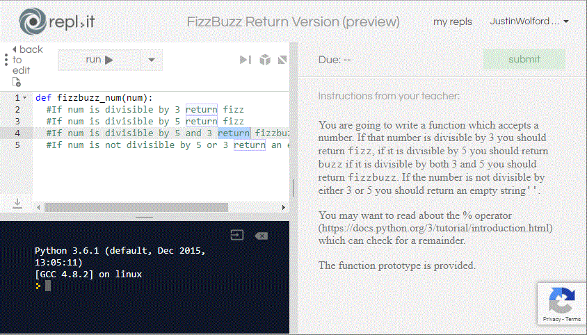

# Repl.it

[Repl.it](repl.it) is a tool that allows instructors to embed interactive code within web pages. It will work in Canvas, HTML pages, really anywhere that an iframe or oEmbed is supported.

Instructors are strongly encouraged to make any code example that exists within course content interactive if possible. 

There are two main ways to display Repls (a code example on Repl.it is called a Repl). One is purely to demonstrate code and to potentially let students tinker with it and it looks like this

<iframe height="400px" width="100%" src="https://repl.it/@JustinWolford/If-Bank-Conditional?lite=true" scrolling="no" frameborder="no" allowtransparency="true" allowfullscreen="true" sandbox="allow-forms allow-pointer-lock allow-popups allow-same-origin allow-scripts allow-modals"></iframe>

The best practice is to use these for code examples which are directly embedded with text or videos explaining concepts. This allows students to see the code run and to tinker with it to see the results of making changes to it. There is no correct or incorrect solution to the problem. It simply runs whatever code it is populated with.

The other option to display code is via an assignment. An image of this is shown below as one needs to be enrolled in a class to access this form of Repl.

Comprehensive documentation of Repl.it can be found [at their official docs page](https://repl.it/site/docs/repls/intro). For most topics, that is where you should go to get information on Repl.it.

## OSU Specifics

### Accounts
Some aspects of the use of Repl.it are specific to OSU. In particular we need to be conscientious about structuring Repls so that we can easily transition from one instructor to another within a class. Repl.it classrooms appear solve this problem for the assignment form of Repl. But we need to be careful as only the original creator of the classroom can manage instructor invites.

It also does not solve the problem with embeddable non-assignment Repls as these cannot be associated to a Repl.it classroom.

The following are the steps to begin using Repl.it in a new class.

1. Confirm with program leadership that the course does not have a preexisting Repl.it account.
1. Email the technology lead asking for a **mailing list** to be created for the course. It will be of the form `coe_cs[course number]@oregonstate.edu`.
1. Make sure you sign up for and become an administrator of the mailing list.
1. Create a Repl.it account using the same name (eg. coe_cs511) and sign up using the mailing list address and a password that is unique and can be shared with other instructors in the course
1. Email the online program technology lead to get that account signed up as a teacher account

If you have **already begun work on a course using a personal Repl.it account** you should contact the program technology lead and work to get your account renamed. If at all possible do not use one account for more than one course.

### Content Backup
Repl.it classrooms can be cloned. This can function as something of a backup. Once the major development work on a course is complete you should contact the program technology lead to have them clone your classroom so that the assignment Repls are backed up in a second classroom incase things somehow get altered or deleted unintentionally.

Individual Repls can not be easily cloned.

To that end **it is suggested** that you keep a class GitHub repository with the code that you use in your Repls. This is mainly a fallback in case we need to rebuild Repls.

It may seem burdensome, but in fact you may find it easier to develop the code for the Repls locally then copy it to a Repl. If you are doing this, then when you complete the code for a Repl, just save each file in a way where you can tell what module it belongs to and periodically commit that directory with those files to the GitHub repo.

## Issues

- A common strategy for unit testing code which deals with input and output is to redirect `stdout`. It appears that this should generally be avoided in Repl.it unit tests. They seem to produce inconsistent and incorrect results if at any point `stdout` is redirect, even calls to redirect and reset it immediately sandwich the call to the function under test. There may be a good solution to this, but this far it seems elusive.